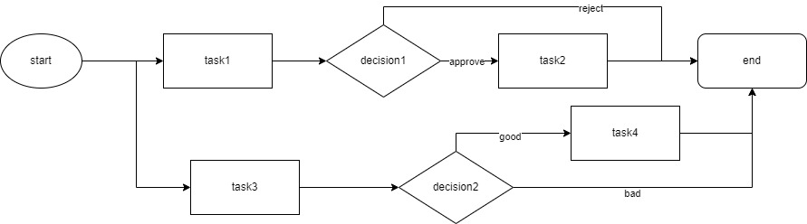

# TinyWorkflow
This is a lightweighted workflow engine with java.

Tinyworkflow是一款非常轻量级的简易工作流引擎，核心代码只有千行；利用DAG进行建模，支持并行异步执行；通过XML简易配置。
# Quick Start
## Demo


Use TinyWorkflow XML to describe this workflow:
```xml
<workflow>
    <id>1001001</id>
    <nodes>
        <start-node id="start" />
        <task-node id="task1">
            <assignee>com.yunfei.tinyworkflow.task.TestTask_1</assignee>
            <max-retry>3</max-retry>
        </task-node>
        <decision-node id="decision1"/>
        <decision-node id="decision2"/>
        <task-node id="task2">
            <assignee>com.yunfei.tinyworkflow.task.TestTask_2</assignee>
        </task-node>
        <task-node id="task3">
            <assignee>com.yunfei.tinyworkflow.task.TestTask_3</assignee>
        </task-node>
        <task-node id="task4">
            <assignee>com.yunfei.tinyworkflow.task.TestTask_4</assignee>
        </task-node>
        <end-node id="end" />
    </nodes>

    <transitions>
        <transition from="start" to="task1" />
        <transition from="task1" to="decision1" />
        <transition from="decision1" to="task2" on="approve" />
        <transition from="decision1" to="end" on="reject" />
        <transition from="task2" to="end" />
        <transition from="start" to="task3" />
        <transition from="task3" to="decision2" />
        <transition from="decision2" to="end" on="bad" />
        <transition from="decision2" to="task4" on="good" />
        <transition from="task4" to="end" />
    </transitions>
</workflow>

```

Before run the engine, please write the config.yaml:
```yaml
tinyworkflow:
  thread-pool:
    core-size: 8
    max-size: 32
    keep-alive-time: 10
  mybatis-plus:
    jdbcUrl: jdbc:mysql://ip:3306/tinyworkflow?allowPublicKeyRetrieval=true&characterEncoding=utf-8&useSSL=false&serverTimezone=GMT%2B8&useUnicode=true
    userName: root
    password: PASS
    driverName: com.mysql.cj.jdbc.Driver
    daoPackageName: com.yunfei.tinyworkflow.dao
```
Tinyworkflow needs to create two tables in MySQL:
```sql
CREATE TABLE `workflow_context` (
                                    `workflow_id` bigint(32) NOT NULL,
                                    `gmt_created` datetime DEFAULT CURRENT_TIMESTAMP,
                                    `gmt_modified` datetime DEFAULT CURRENT_TIMESTAMP,
                                    `context` text CHARACTER SET latin1,
                                    `is_deleted` tinyint(1) DEFAULT '0',
                                    PRIMARY KEY (`workflow_id`)
) ENGINE=InnoDB DEFAULT CHARSET=utf8mb4

CREATE TABLE `workflow` (
                            `id` bigint(32) NOT NULL AUTO_INCREMENT,
                            `workflow_id` bigint(32) DEFAULT NULL,
                            `gmt_created` datetime DEFAULT CURRENT_TIMESTAMP,
                            `gmt_modified` datetime DEFAULT CURRENT_TIMESTAMP,
                            `task_name` varchar(45) CHARACTER SET latin1 DEFAULT NULL,
                            `status` varchar(45) CHARACTER SET latin1 DEFAULT NULL,
                            `is_deleted` tinyint(1) DEFAULT '0',
                            PRIMARY KEY (`id`),
                            UNIQUE KEY `id_UNIQUE` (`id`)
) ENGINE=InnoDB AUTO_INCREMENT=109 DEFAULT CHARSET=utf8mb4
```
## Run 
```java
public class TestWfEngine {
    private IWfEngine wfEngine = new WfEngine();
    @Test
    public void testRun() throws InterruptedException {
        wfEngine.init("workflow.xml");
        wfEngine.asyncRun((res)->{
            WfAsyncCallbackResult r = (WfAsyncCallbackResult) res;
            System.out.println(r);
        });
        Thread.sleep(200000);
    }
}
```
The logs:
```text
15:04:59.380 [pool-1-thread-1] INFO  c.y.t.engine.StatusManager - START NODE is ready.
15:04:59.383 [pool-1-thread-3] INFO  c.y.t.engine.StatusManager - node:task3's upstream all completed.
15:04:59.383 [pool-1-thread-2] INFO  c.y.t.engine.StatusManager - node:task1's upstream all completed.
15:04:59.384 [pool-1-thread-3] INFO  c.y.tinyworkflow.task.TestTask_3 - Task3 run.
15:04:59.384 [pool-1-thread-2] INFO  c.y.tinyworkflow.task.TestTask_1 - Task1 run.
15:05:00.385 [pool-1-thread-3] INFO  c.y.tinyworkflow.task.TestTask_3 - Task3 completed.
15:05:00.386 [pool-1-thread-4] INFO  c.y.t.engine.StatusManager - node:decision2's upstream all completed.
15:05:00.387 [pool-1-thread-5] INFO  c.y.t.engine.StatusManager - node:task4's upstream all completed.
15:05:00.388 [pool-1-thread-5] INFO  c.y.tinyworkflow.task.TestTask_4 - Task4 run.
15:05:01.384 [pool-1-thread-2] INFO  c.y.tinyworkflow.task.TestTask_1 - Task1 completed.
15:05:01.385 [pool-1-thread-6] INFO  c.y.t.engine.StatusManager - node:decision1's upstream all completed.
15:05:01.385 [pool-1-thread-7] INFO  c.y.t.engine.StatusManager - node:task2's upstream all completed.
15:05:01.386 [pool-1-thread-7] INFO  c.y.tinyworkflow.task.TestTask_2 - Task2 run.
15:05:01.388 [pool-1-thread-5] INFO  c.y.tinyworkflow.task.TestTask_4 - Task4 completed.
15:05:01.388 [pool-1-thread-8] INFO  c.y.t.engine.StatusManager - Add one to the completion number of upstream nodes of the end node.
15:05:03.387 [pool-1-thread-7] INFO  c.y.tinyworkflow.task.TestTask_2 - Task2 completed.
15:05:03.387 [pool-1-thread-7] INFO  c.y.t.engine.StatusManager - Add one to the completion number of upstream nodes of the end node.
15:05:03.387 [pool-1-thread-7] INFO  c.y.t.engine.StatusManager - node:end's upstream all completed.
15:05:03.387 [pool-1-thread-7] INFO  c.y.tinyworkflow.engine.Scheduler - work flow run completed!
WfAsyncCallbackResult(result={task1=approve, task2=2, task3=good, task4=task4 result})
```